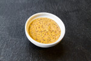

# Dijon.nvim



Just like dijon mustard some people might like it, some people don't. This plugin adds a simple addition to neovim to integrate with obsidian notes.

## Motivation

Moving between [Obsidian](https://obsidian.md) and Neovim to create/update daily notes and to copy from Neovim buffer and then paste into [Obsidian](https://obsidian.md) is a pain.

## What it does
- create/update [Obsidian](https://obsidian.md) notes 

## What it does not do
- preview Markdown files
- full blown integration

## Setup

>example here is using lazy

```lua
    {
        "NoseferatuWKF/dijon.nvim",
        {
            opts = {
                -- vault is the only requirement to setup
                vault = "/path/to/vault",
                -- defaults
                -- key_map = "<leader>on",
                -- width = math.floor(vim.api.nvim_win_get_width(0) / 2),
                -- height = math.floor(vim.api.nvim_win_get_height(0) / 2),
                -- if format is different than what obsidian default gives you,
                -- you need to set it up here with a lua compatible format
                -- format = os.date("%F, d"),
                -- border = "rounded",
            }
        }
    }
    
```
